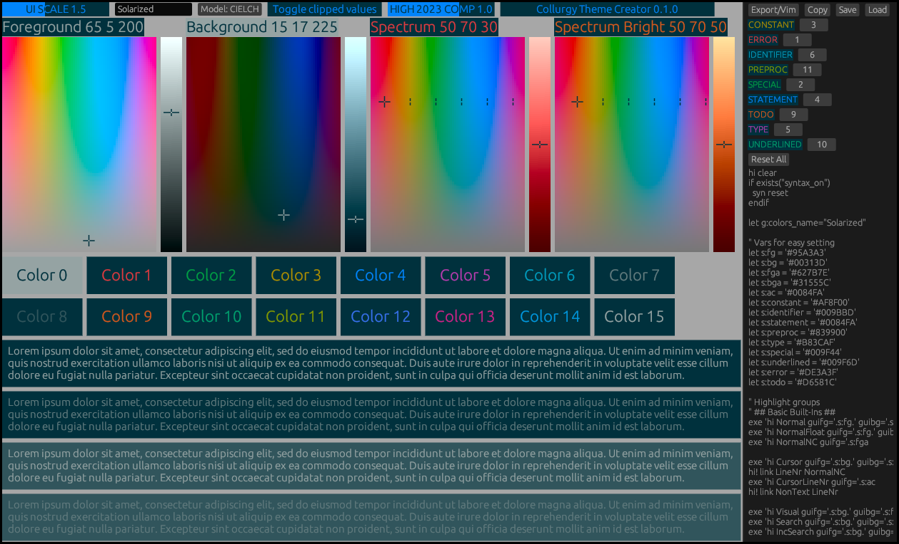

# Collurgy
A simple cross-platform theme creation tool centering around the idea of a Uniform Color Space (UCS) for pleasant hue/chroma distributions.



## Features
  * Linux, Windows, MacOS
  * Many color spaces: CIE Lab, Oklab, JzAzBz, HSV
  * Many [built-in exporters](./builtins/)
    * Dunst
    * Dwarf Fortress
    * i3/SwayWM
    * Kitty
    * PPM Image
    * [Neo]Vim
    * XResources
  * Write your own [custom exporters](./exporters/bsz-i3-blocklets.toml)
  * Save and load [presets](./examples/) in TOML/JSON format

## Installation
Either download a binary for your platform of choice from the [Master Release Action](https://github.com/Beinsezii/collurgy/actions/workflows/build_release_master.yml) or install with Cargo
```bash
cargo install --git https://github.com/Beinsezii/collurgy.git
```
